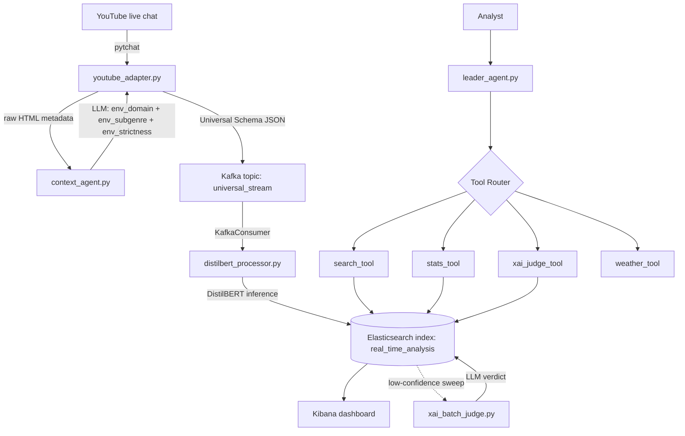

# Architecture

This document maps the paper's 5-layer figure (Internship_report §3, Fig. 1) onto the actual `src/` folder structure, so a reviewer can move between the report and the code without guessing.

## Layer map

```
+--------------------------------------------------------------+
|  Layer 5 — Analyst Surface                                   |
|  src/Zone3_Agents/leader_agent.py        (orchestrator)      |
|  src/Zone3_Agents/tools/*.py             (tool registry)     |
+--------------------------------------------------------------+
|  Layer 4 — Storage & Visualisation                           |
|  Elasticsearch  (index: real_time_analysis)                  |
|  Kibana         (dashboard.ndjson)                           |
+--------------------------------------------------------------+
|  Layer 3 — Tier-1 Static Classifier                          |
|  src/Zone2_AIModels/distilbert_processor.py                  |
|  src/Zone3_Agents/xai_batch_judge.py    (async Tier-2)       |
+--------------------------------------------------------------+
|  Layer 2 — Streaming Backbone                                |
|  Kafka 7.5.0 + Zookeeper 3.9 + Spark 3.4.1                   |
|  docker-compose.yml                                          |
+--------------------------------------------------------------+
|  Layer 1 — Producers + Context Agent                         |
|  src/Zone1_DataHighway/omni_ingest.py           (router)     |
|  src/Zone1_DataHighway/adapters/youtube_adapter.py           |
|  src/Zone1_DataHighway/adapters/context_agent.py             |
+--------------------------------------------------------------+
```

## Flow diagram (data path)



## Folder map

```
F:\hate-speech-pipeline\
├── docker-compose.yml          Layer 2 stack (Kafka, Zookeeper, Spark, ES, Kibana)
├── dashboard.ndjson            Kibana dashboard import
├── data/                       Datasets (gitignored)
│   ├── Davidson_dataset.csv
│   ├── HXE_dataset.json
│   ├── ToxiGen_dataset.csv
│   ├── Final_Mega_Dataset.csv
│   ├── live_youtube_validation.csv   Dataset B (manual ground truth)
│   ├── final_results_analyzed.csv    Tri-model side-by-side
│   └── stream_log.csv                CSV audit log (written by processor)
├── models/                     Pre-trained artefacts (gitignored)
│   ├── bert_final/             DistilBERT fine-tuned checkpoint
│   ├── logistic_regression.pkl Classical baseline
│   ├── svm_model.pkl           Classical baseline
│   └── tfidf_vectorizer.pkl    Feature extractor for the .pkl baselines
├── docs/                       Thesis-facing documentation
│   ├── ARCHITECTURE.md         (this file)
│   ├── SCHEMA.md               Universal payload + ES doc schema
│   ├── PROMPTS.md              Canonical text of every LLM prompt
│   ├── EVAL.md                 How to reproduce Table 8 (93.5%)
│   └── ROADMAP.md              Stage 0 → Stage 7 plan
├── scripts/
│   └── normalize_domains.py    Backfill open-taxonomy domains to closed taxonomy
├── src/
│   ├── Zone1_DataHighway/      Layer 1 — ingestion
│   │   ├── omni_ingest.py      YouTube ingestion entry point
│   │   └── adapters/
│   │       ├── youtube_adapter.py
│   │       └── context_agent.py
│   ├── Zone2_AIModels/         Layer 3 — Tier-1 static classifier
│   │   └── distilbert_processor.py
│   ├── Zone3_Agents/           Layer 5 — Tier-2 agents + analyst console
│   │   ├── leader_agent.py     Orchestrator
│   │   ├── xai_batch_judge.py  Async Tier-2 sweep
│   │   ├── check_db_size.py    Schema inspector
│   │   └── tools/
│   │       ├── search_tool.py
│   │       ├── stats_tool.py
│   │       ├── xai_judge_tool.py
│   │       └── weather_tool.py
│   ├── shared_utils/           Cross-cutting helpers
│   │   ├── config.py           Env-driven configuration
│   │   ├── prompts.py          Canonical LLM prompts (single source of truth)
│   │   └── llm.py              Thin Ollama wrapper (temp=0, format=json, 1 retry)
│   ├── calculate_thesis_metrics.py
│   ├── export_subset.py
│   ├── reset_db.py             Destructive — requires --yes
│   └── Hate_speach_Project.ipynb   Training notebook for DistilBERT
├── README.md
├── requirements.txt
└── Internship_report_Draft_1 (1).pdf   Authoritative spec / report
```

## Process boundaries

Three independent processes have to run for the pipeline to be live:

| # | Process | Command | What it does |
|---|---------|---------|--------------|
| 1 | Producer | `python src/Zone1_DataHighway/omni_ingest.py` | Asks for a YouTube URL, scrapes metadata, runs the Context Agent, pushes chat messages to Kafka. |
| 2 | Processor | `python src/Zone2_AIModels/distilbert_processor.py` | Consumes the Kafka topic, runs DistilBERT, writes to Elasticsearch + CSV log. |
| 3 | Tier-2 sweep | `python src/Zone3_Agents/xai_batch_judge.py` | Periodically audits low-confidence ES records and overlays the LLM verdict. Run on a cadence — once per minute, hour, or whenever you want a sweep. |

The Leader Agent (`leader_agent.py`) is a fourth, on-demand process the analyst opens when they want to query the pipeline.
