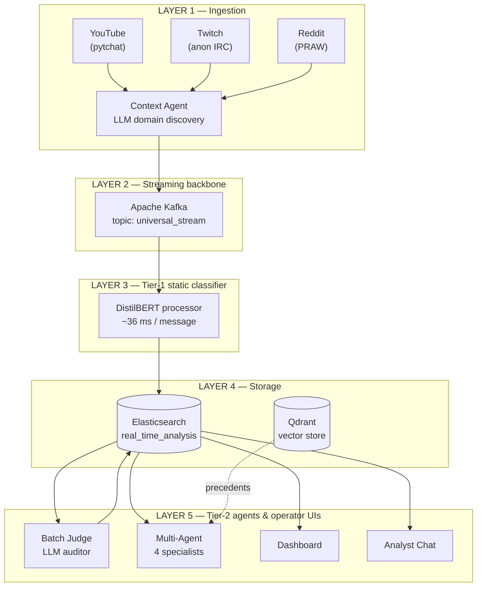
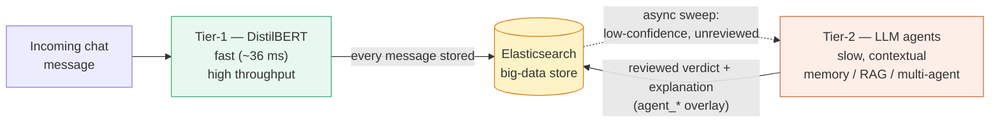
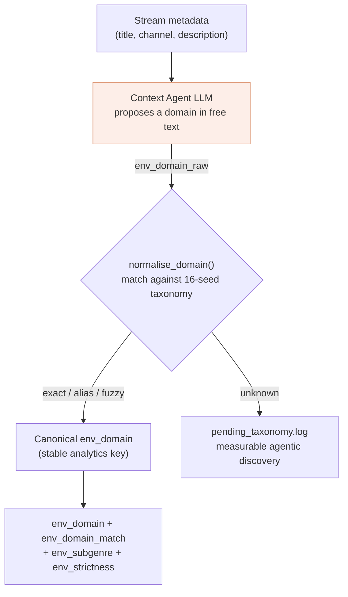
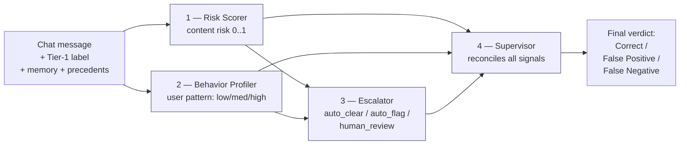
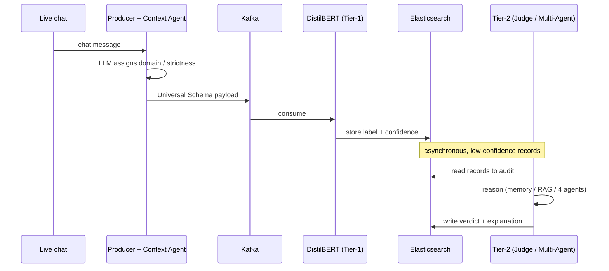
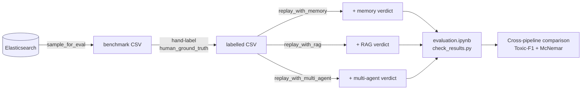
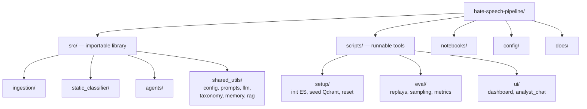

# Thesis diagrams (Mermaid)

Paste any block below into <https://mermaid.live>, then **Export → SVG** (vector,
best for a report) or **PNG**. Each diagram notes where it fits in the thesis.

> Tip: in mermaid.live, switch the theme to "neutral" for a clean print look.

---

## 1. System architecture — the 5-layer pipeline

*Use in: System / Architecture chapter (the main figure).*

---

## 2. The two-tier idea (the thesis thesis)

*Use in: Introduction — explains the core design in one picture.*

---

## 3. Agentic Context Agent — discovery, not classification

*Use in: Methodology — the Stage 0.5 contribution (the agentic claim).*

---

## 4. Multi-Agent decomposition (Stage 4 — your best result)

*Use in: Methodology / Results — give this its own figure, it's the novel win.*

---

## 5. Message lifecycle (sequence)

*Use in: System chapter — shows the runtime flow of one message.*

---

## 6. Evaluation pipeline (how the variants are produced and compared)

*Use in: Methodology / Evaluation — reproducibility figure.*

---

## 7. Code organisation (src = library, scripts = tools)

*Use in: Appendix — the repository structure.*

---

## Rendering checklist

- Vector export (SVG) keeps text crisp at any size — prefer it for LaTeX/Word.
- If a label is cut off, add ` ` to wrap it manually.
- Keep one diagram per figure in the report; don't combine.
- Caption each with a figure number and one sentence (e.g. *"Figure 3: the
  four-agent Tier-2 decomposition; the Supervisor reconciles the upstream
  specialists into the final verdict."*).
